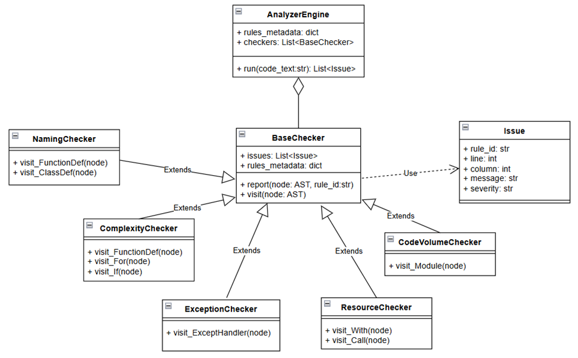

# Архитектура системы

Ядро анализатора разработано с использованием принципов модульности, расширяемости и слабой связанности компонентов. В основе лежит паттерн "Visitor" для обхода Абстрактного Синтаксического Дерева (AST) и паттерн "Strategy" для динамического подключения правил анализа.

## Общая схема компонентов

# Компоненты системы
## 1. AnalyzerEngine
Является центральным диспетчером. Отвечает за:

- Загрузку метаданных правил из rules.yaml.
- Инициализацию всех активных чекеров (плагинов).
- Однократный парсинг исходного кода в AST-дерево.
- Обход AST-дерева с помощью всех подключенных чекеров.
- Сбор итоговых результатов (списков Issue и Metric).
  
## 2. BaseChecker и специализированные чекеры
BaseChecker - это абстрактный класс, который наследуется от ast.NodeVisitor и предоставляет базовый функционал для всех проверок: хранение списка issues и доступ к rules_metadata.
Специализированные чекеры (плагины):

- NamingChecker: Проверяет соответствие имен функций и наличия Docstrings.
- ComplexityChecker: Вычисляет цикломатическую сложность функций и сообщает о превышении порога.
- ExceptionChecker: Обнаруживает пустые или подавляющие исключения блоки except.
- ResourceChecker: Контролирует использование менеджеров контекста (with) для работы с ресурсами.
- PathChecker: Идентифицирует использование абсолютных путей в строковых константах.
- CodeVolumeChecker: Собирает общие метрики объема кода, такие как Lines of Code (LOC).
  
## 3. Модели данных (models.py)

- Issue: Dataclass для хранения информации о найденном нарушении (ID правила, сообщение, строка, колонка, критичность).
- Дополнительные модели для хранения метрик (в виде кортежей или словарей в памяти).
  
## 4. Менеджер базы данных (database.py)
Класс DbManager управляет взаимодействием с PostgreSQL. Отвечает за:

- Подключение к БД и автоматическую инициализацию таблиц при первом запуске.
- Сохранение результатов анализа (AnalysisRun, Issue, Metric).
- Загрузку конфигурации БД из переменных окружения (.env).